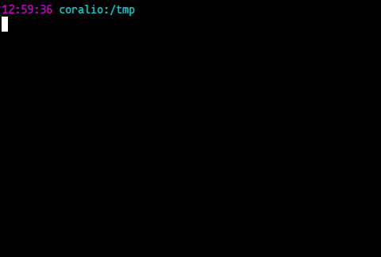

# dart-bash_completion

Collection of scripts to provide tab completion in Bash for Dart SDK command line programs.

## Status

- Options and commands completion **works well**
- Sub-commands completion (e.g. pub cache add) **doesn't work yet**
- File type completion **doesn't work as it should**. For example, completion on `dart` command should only return *.dart files.
- Pub packages completion is **not implemented yet**.

[Report bugs or suggestions](https://github.com/claudiodangelis/dart-bash_completion/issues)

## Installation

    git clone https://github.com/claudiodangelis/dart-bash_completion
    cd /path/to/dart-bash_completion
    ./install.bash

Since these scripts are installed under `/etc/`, you will be asked to [run some commands as super user](https://github.com/claudiodangelis/dart-bash_completion/blob/master/install.bash#L21,L30).

Alternatively, you can manually install these scripts as follows:

- **Linux**: install the `bash-completion` package from your distro's package manager (you may already have it installed), then copy these scripts to `/etc/bash_completion.d`.

- **Mac OS X**: install the `bash-completion` package from your favorite package manager (e.g. Homebrew, MacPorts, etc), then copy these scripts to to `/etc/bash_completion.d`. Note that you can find this directory under `/sw/etc` or `/opt/local/etc`.

Arch Linux users can get the [bash-completion-dart-git](https://aur.archlinux.org/packages/bash-completion-dart-git/)  package from AUR.

You have to restart the shell to get completion running.

A note for developers: you can quickly load these scripts in the current shell by typing:

    . ./dart
    . ./dart2js
    . ./pub
    # ...... and so on

## Screencast

## License

Apache License, Version 2.0

See _LICENSE_

## Authors

Claudio d'Angelis <claudiodangelis@gmail.com>

[Robert Åkerblom-Andersson](https://github.com/Scorpiion)

[You!](https://github.com/claudiodangelis/dart-bash_completion/fork)
